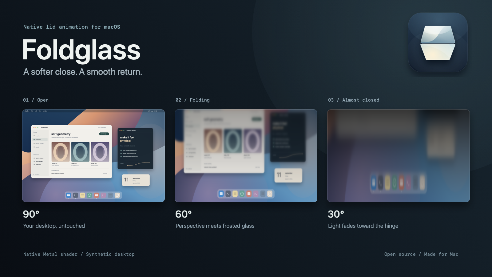

# foldglass

**your screen follows the lid.**

a native macbook menu bar app that turns closing the lid into a smooth glass effect. the desktop stretches toward the hinge, blurs from the top, and gradually fades. open the lid and the effect reverses.



[download v1.3.0](https://github.com/aldikosh23/Foldglass/releases/tag/v1.3.0) · [russian guide](docs/README.ru.md) · [build from source](#build-from-source) · [report an issue](https://github.com/aldikosh23/Foldglass/issues)

| platform | implementation | license |
| --- | --- | --- |
| apple silicon · macos 14+ | swift · appkit · swiftui · metal | [mit](LICENSE) |

## the effect


demo scene, rendered with the app's shader. this is a synthetic desktop, not a recording of a physical lid movement.

- follows the actual lid angle, including when you stop halfway or open it again.
- animates the lock screen while opening after sleep, before touch id or password entry.
- blends into the desktop near the activation angle to soften the transition.
- adjusts the starting angle, frosted glass, dimming, and perspective stretch.
- runs in the menu bar, with optional background launch at login.
- includes an in-window preview that needs no screen recording permission.
- supports english and russian, with english selected by default.

an independent visual recreation inspired by the iphone duo folding animation. this is not apple's original effect or an apple product.

## install

1. download [Foldglass-v1.3.0-macos-arm64.zip](https://github.com/aldikosh23/Foldglass/releases/download/v1.3.0/Foldglass-v1.3.0-macos-arm64.zip), unzip it, and move `Foldglass.app` into **applications** before opening it.
2. open the app. the release is ad hoc signed and **not notarized**. if macos blocks it and you trust this download, open **system settings > privacy & security > open anyway**, then confirm. see [apple's explanation](https://support.apple.com/en-us/102445).
3. click **grant screen access** and enable foldglass in the screen recording section of privacy & security. accept an app restart if macos requests it.
4. open the lid past **92°**, then slowly lower it below **90°**. the effect should follow the lid and clear when it opens again.

**hardware support:** the app requires an accessible apple lid-angle hid sensor and metal. physical sensor behavior has been checked on a **macbook air m5 running macos 27**. macos 14 is the build's minimum target; other macbook models and os versions have not been verified. if the sensor is unavailable, the app reports it. the in-window preview still works on a metal-capable mac.

release checksums are available as `SHA256SUMS.txt`. place it beside the downloaded archive and run:

```sh
shasum -a 256 -c SHA256SUMS.txt
```

## everyday use

close the settings window to leave foldglass running in the menu bar. click the laptop icon to reopen settings, pause the effect, play a desktop demo, or quit.

| control | what it does |
| --- | --- |
| play | plays a six-second animation inside the preview |
| desktop demo | plays the effect on the built-in display for six seconds |
| refresh snapshot | replaces the preview image with a fresh desktop snapshot |
| start angle | sets the activation angle from 30° to 115°; default 90° |
| use current lid position | sets the activation angle 10° below the current lid angle, within 30-115° |
| frosted glass | controls blur strength |
| dimming | controls how quickly the screen fades |
| stretch | controls perspective compensation around the hinge |
| reset effect | restores the effect settings, including the 90° start angle |

**working with a tilted screen:** if you use your macbook on your lap, click **use current lid position** at your comfortable viewing angle. small tilts will then stay above the activation threshold. for example, a current angle of 80° sets the start to 70° and the rearm angle to 72°.

**language:** english is the default, regardless of your macos language. use the **language** selector in settings to choose **english** or **русский**. the interface updates immediately and remembers your choice after restarting. this guide uses the english control names.

**cancel:** on the desktop, click to dismiss the effect. escape also works when macos delivers the key event to the app. after cancellation, raise the lid at least 2° above the configured starting angle to rearm it. the default rearm angle is 92°. on the lock screen, the overlay passes mouse clicks through and does not take keyboard focus; it clears when you unlock or raise the lid to the start angle.

**launch at login:** turn on **launch at login** in settings. subsequent login launches stay in the background with a menu bar icon and no settings window. startup is opt-in and uses `SMAppService`. if macos requests approval, click **allow in system settings** and allow foldglass. disable startup using the same toggle or **system settings > general > login items & extensions**. keep the installed app in its original location while this is enabled.

**pause or stop:** **pause effect** pauses the current session. **quit foldglass** exits the app. quitting does not disable launch at login.

**opening after sleep:** open the lid past the rearm angle, close it fully, wait for sleep, then slowly reopen it. once the display wakes, the effect follows the actual lid angle on the lock screen, before unlocking. it uses a fresh image of the lock screen, including its clock, and clears on unlock or when the lid reaches the start angle. if the lid is already open, no delayed animation is replayed. reopening while the desktop remains unlocked follows the angle normally.

**experimental lock screen support:** physical opening from sleep before touch id has been checked on a macbook air m5 with macos 27. displaying the overlay uses private skylight apis and may stop working after a macos update. this covers locking an existing logged-in session; filevault's startup unlock screen and login before the app has started are not supported.

## privacy and limits

foldglass captures the built-in display when an effect starts and animates **one usable screenshot**. the image and its gpu textures stay in memory; the app does not save screenshots to disk. **refresh snapshot** also captures a single image for the preview and keeps it in memory until replaced or the app quits.

the lock screen effect captures a fresh lock screen image through screencapturekit. if macos returns a blank frame during wake, foldglass briefly checks for a ready image before showing the overlay. blank frames are discarded; if no image becomes available in time, the effect is skipped instead of covering the screen in black. it does not reuse a desktop image from before locking. its overlay passes mouse input through, does not take keyboard focus, and disappears on unlock.

there are no accounts, telemetry, analytics, automatic updates, or network requests in the app. clicking its reference link opens the website in your browser. microphone and accessibility permissions are not required.

- the image is frozen while the effect runs. videos and other changing content are not live inside the overlay.
- only the built-in display receives the effect; external screens are unaffected.
- the app does not prevent sleep. lock screen rendering is experimental and depends on private macos apis.
- sensor updates run at 30 hz, with visual smoothing between readings.
- perceived perspective depends on your viewing position. tune **stretch** to suit it.

## build from source

use an apple silicon mac with macos 14 or later and apple's command line tools. install the tools with `xcode-select --install` if needed. no package manager or dependency download is required. the lock screen integration includes code based on skylightwindow; see [third-party notices](THIRD_PARTY_NOTICES.md).

```sh
git clone https://github.com/aldikosh23/Foldglass.git
cd Foldglass
./build.sh
open build/Foldglass.app
```

the script compiles the arm64 app, copies its resources, applies an ad hoc signature, and checks the app bundle. for daily use and launch at login, quit the app and move `build/Foldglass.app` into applications first.

```sh
# curve and startup behavior checks
./scripts/test.sh

# also render and check real metal frames on a mac with a gpu
RUN_METAL_TESTS=1 ./scripts/test.sh
```

automated checks cover animation curves and selected rendering endpoints. they do not replace checking screen recording permission, the physical hinge, login behavior, sleep, and wake on a real macbook.

| source | responsibility |
| --- | --- |
| `Sources/LidSensor.swift` | reads the lid's hid feature report on a serial queue |
| `Sources/AppModel.swift` | captures the screen and manages effect state |
| `Sources/LockScreenSpace.swift` | places the lock screen overlay using private skylight apis |
| `Sources/LoginItem.swift` | registers background startup with macos |
| `Sources/FoldCurve.swift` | maps lid angle to progress and projection |
| `Sources/FoldRenderer.swift` | prepares blur levels and renders with metal |
| `Resources/Fold.metal` | stretches, blurs, and dims the image |
| `Sources/SettingsView.swift` | preview and settings interface |

to rebuild the release archive and checksums, run `./scripts/release.sh`. to regenerate the readme images from the actual metal renderer, install ffmpeg and run `./scripts/media.sh`. the app itself does not require ffmpeg.

## contribute

issues and focused pull requests are welcome. for a sensor problem, include your macbook model, macos version, exact error, and whether the displayed angle changes when you move the lid. for an animation problem, describe the angle, effect settings, and steps to reproduce it.

## references and license

- [apple iphone duo](https://www.apple.com/iphone-duo/) and [apple's original animation](https://www.apple.com/105/media/us/iphone-duo/2026/9305e4b9-72d9-4c05-9381-b572adadd5e5/anim/hero/large_2x.mp4): visual references.
- [sam gold's lidanglesensor research](https://github.com/samhenrigold/LidAngleSensor): reference for the lid-angle hid protocol. foldglass uses its own implementation; no source code was copied from that project.
- [lakr233's skylightwindow](https://github.com/Lakr233/SkyLightWindow): basis for the private skylight lock screen integration, under the mit license. see [third-party notices](THIRD_PARTY_NOTICES.md).

released under the [mit license](LICENSE). apple, iphone, macbook, and macos are trademarks of apple inc. this project is not affiliated with or endorsed by apple.
