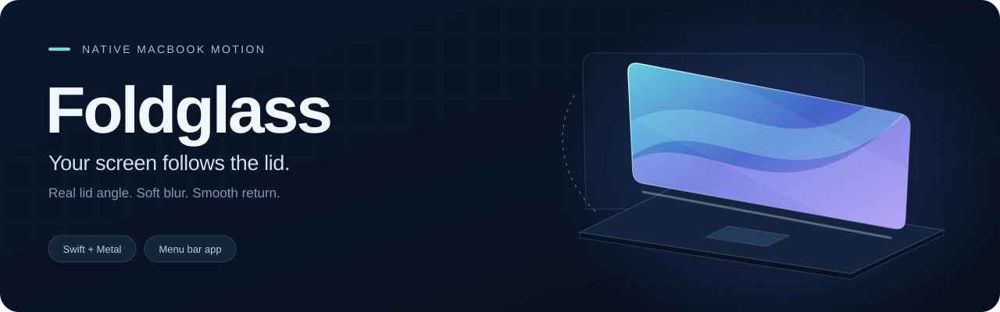

<p align="center">
  
</p>

<p align="center">
  <a href="https://github.com/aldikosh23/Foldglass/releases/tag/v1.3.0"></a>
  
  
  <a href="LICENSE"></a>
</p>

<p align="center">
  <b>English</b> · <a href="docs/README.ru.md">Русский</a> · <a href="#install">Install</a> · <a href="#settings">Settings</a> · <a href="https://github.com/aldikosh23/Foldglass/issues">Report an issue</a>
</p>

Foldglass brings a glass animation to your MacBook's lid. Close it, and a soft band of blur and darkness moves from the top edge toward the hinge. The lower part stays clear and lit longer as the image stretches. Open it, and the effect reverses with the actual lid angle.

It runs in the menu bar, supports **English and Russian**, and can start quietly when you log in. English is the default language.

## See it in motion


*Rendered with the app's Metal shader on a synthetic desktop. This preview is not a recording of physical lid movement.*

| Physical motion | Glass controls | Quiet operation |
| :--- | :--- | :--- |
| Follows the lid as it closes, pauses, or opens again. | Adjust the activation angle, blur, dimming, and stretch. | Menu bar app with optional background launch at login. |
| Works on the lock screen when reopening after sleep. | Calibrate the starting angle for your comfortable position. | Preview the effect without granting screen access. |

## Install

1. **Download and move the app.** Get [Foldglass-v1.3.0-macos-arm64.zip](https://github.com/aldikosh23/Foldglass/releases/download/v1.3.0/Foldglass-v1.3.0-macos-arm64.zip), unzip it, and move `Foldglass.app` into **Applications**.
2. **Open Foldglass.** The app is ad hoc signed and **not notarized**. If macOS blocks it and you trust the download, use **System Settings > Privacy & Security > Open Anyway** and confirm. [Apple's guide](https://support.apple.com/en-us/102445).
3. **Allow screen capture.** Click **Grant screen access**, then enable Foldglass in the screen recording section of Privacy & Security. Restart the app if macOS asks.
4. **Try the lid.** Open it past **92°**, then slowly lower it below **90°**. The effect follows the movement and clears as you open the lid again.

> [!NOTE]
> Physical operation has been tested on a **MacBook Air M5 running macOS 27**. The build targets macOS 14 or later, but other MacBook models and OS versions have not been verified. An accessible Apple lid-angle HID sensor and Metal are required. The in-window preview works without the sensor on a Metal-capable Mac.

<details>
<summary><b>Verify the download</b></summary>

Download `SHA256SUMS.txt` from the same release, place it beside the archive, and run:

```sh
shasum -a 256 -c SHA256SUMS.txt
```

</details>

## Settings

Open the laptop icon in the menu bar to access settings, pause the effect, run a demo, or quit. Closing the settings window leaves Foldglass running in the background.

| Setting | Default | What it changes |
| :--- | :--- | :--- |
| **Start angle** | 90° | The angle below which the effect begins. Range: 30° to 115°. |
| **Frosted glass** | 72 | Blur strength, spreading from the upper edge. |
| **Dimming** | 1.05× | How quickly the image fades. Lower it for a brighter effect. |
| **Stretch** | 100% | Perspective compensation around the hinge. Set to 0% to disable stretching. |
| **Language** | English | Switch the entire interface between English and Russian. |

Settings are saved between launches. Changing the start angle clears the current effect; raise the lid at least **2° above the new start angle** to rearm it.

**Using your MacBook on your lap?** Set the lid to a comfortable position and click **Use current lid position**. The start angle moves 10° below that position, within the supported range. For example, an 80° viewing angle sets activation to 70° and rearming to 72°. **Reset effect** restores the defaults.

| Control | Action |
| :--- | :--- |
| **Play** | Run a six-second animation inside the preview. |
| **Preview angle** | Inspect any position without moving the lid. |
| **Refresh snapshot** | Use a fresh desktop image in the preview. |
| **Desktop demo** | Run the effect on the built-in display for six seconds. |

**Cancel an effect:** Click the mouse or trackpad on the desktop. Escape also works when macOS delivers the key event to the app. Raise the lid above the rearm angle before trying again. On the lock screen, the overlay passes clicks through, never takes keyboard focus, and clears on unlock or when the lid reaches the start angle.

### Launch in the background

Enable **Launch at login** in settings. Future login launches show only the menu bar icon, without opening settings or adding a Dock icon. If macOS requests approval, click **Allow in System Settings** and allow Foldglass.

Disable startup with the same toggle or in **System Settings > General > Login Items & Extensions**. Keep the app in Applications while startup is enabled. **Quit Foldglass** stops the app but does not disable launch at login.

### Opening after sleep

Open the lid past the rearm angle, close it fully, wait for sleep, then slowly reopen it. Once the display wakes, Foldglass follows the physical angle on the lock screen, before Touch ID or password entry. There is no delayed replay if the lid is already open.

If macOS initially returns a blank screen image, Foldglass briefly waits for a usable frame. Empty frames are discarded instead of covering the display in black.

> [!IMPORTANT]
> Lock screen support is experimental and uses private SkyLight APIs. macOS updates may affect it. This works within an existing logged-in session; FileVault's startup unlock screen and the first login before Foldglass starts are not supported.

## Privacy and limits

- **Images stay in memory.** Each effect animates one usable screenshot. Captured images and GPU textures are not saved to disk. A refreshed preview image stays in memory until replaced or the app quits.
- **A fresh image on lock.** The lock screen effect captures the lock screen itself. It does not reuse a desktop image from before locking.
- **No accounts or network service.** The app has no telemetry, analytics, automatic updates, or network requests. Its reference button opens a website in your browser.
- **Screen recording permission only.** Microphone and Accessibility permissions are not required.
- **A frozen image during the effect.** Videos, clocks, and changing window content do not update inside the overlay.
- **Built-in display only.** External displays are unaffected, and Foldglass does not prevent system sleep.

## Troubleshooting

<details>
<summary><b>Permissions, the lid sensor, and startup</b></summary>

| Symptom | What to check |
| :--- | :--- |
| Screen access is required | Enable Foldglass in macOS screen recording settings, then restart it if requested. |
| “Raise lid above…” | Raise the lid at least 2° above the configured start angle to rearm the effect. |
| Lid-angle sensor is missing | Your Mac or OS may not expose the required HID sensor. The preview can still work. |
| Preview works, but the desktop does not | Check screen access, the pause switch, the start angle, and the built-in display. |
| The lock screen effect is skipped | macOS may not have supplied a usable frame before the lid opened. Empty frames are never displayed. |
| The app does not start at login | Check Login Items and confirm the app is still in Applications. |
| Nothing happens on an external display | Only the MacBook's built-in display receives the effect. |

For a sensor error, include the exact message, MacBook model, macOS version, and whether the displayed angle changes. For a visual problem, include the four effect settings and steps to reproduce it.

[Open an issue](https://github.com/aldikosh23/Foldglass/issues)

</details>

## Build from source

Use an Apple Silicon Mac with macOS 14 or later and Apple's Command Line Tools. Install them with `xcode-select --install` if needed. No package manager or dependency download is required.

```sh
git clone https://github.com/aldikosh23/Foldglass.git
cd Foldglass
./build.sh
open build/Foldglass.app
```

For daily use, quit the app and move `build/Foldglass.app` into Applications before enabling launch at login.

<details>
<summary><b>Checks and source map</b></summary>

```sh
# Curves, localization, login, wake behavior, and blank-frame checks
./scripts/test.sh

# Include real Metal rendering checks on a Mac with a GPU
RUN_METAL_TESTS=1 ./scripts/test.sh
```

Automated checks do not replace testing screen permission, the physical lid, login, sleep, and wake on a real MacBook.

| Source | Responsibility |
| :--- | :--- |
| `Sources/LidSensor.swift` | Read the lid's HID report at 30 Hz on a serial queue. |
| `Sources/AppModel.swift` | Capture the display and manage effect state. |
| `Sources/SnapshotBrightness.swift` | Reject empty lock screen captures during wake. |
| `Sources/LockScreenSpace.swift` | Place the lock screen overlay with private SkyLight APIs. |
| `Sources/LoginItem.swift` | Register background startup through `SMAppService`. |
| `Sources/FoldCurve.swift` | Map lid angle to progress, projection, and overlay opacity. |
| `Sources/FoldRenderer.swift` | Prepare blur levels and render with Metal. |
| `Resources/Fold.metal` | Stretch, blur, and dim the captured image. |
| `Sources/SettingsView.swift` | Present the preview and settings. |

Run `./scripts/release.sh` to build a release archive and checksums. To regenerate the shader preview images, install FFmpeg and run `./scripts/media.sh`. The app does not require FFmpeg.

</details>

## References and license

Foldglass is an independent visual recreation inspired by the [iPhone Duo](https://www.apple.com/iphone-duo/) and [Apple's original animation](https://www.apple.com/105/media/us/iphone-duo/2026/9305e4b9-72d9-4c05-9381-b572adadd5e5/anim/hero/large_2x.mp4). It is not an Apple product or Apple's original shader.

- [Marques Brownlee's demonstration](https://www.tiktok.com/@mkbhd/video/7683665862523440398) and [Rudy's transition reference](https://www.tiktok.com/@rudy.esmlrr/video/7683627057833610528): additional motion references.
- [Timothée Gauthier's MacBook demonstration](https://www.tiktok.com/@tim_gauthier/video/7684021769346338056): reference for the soft shade moving toward the hinge.
- [Sam Gold's LidAngleSensor research](https://github.com/samhenrigold/LidAngleSensor): HID protocol reference. Foldglass uses its own implementation.
- [SkyLightWindow by Lakr Aream](https://github.com/Lakr233/SkyLightWindow): basis for the private SkyLight integration, used under the MIT license. See [Third-party notices](THIRD_PARTY_NOTICES.md).

Released under the [MIT license](LICENSE). Apple, iPhone, MacBook, and macOS are trademarks of Apple Inc. This project is not affiliated with or endorsed by Apple.
