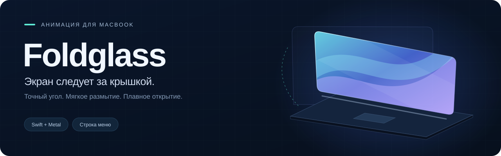
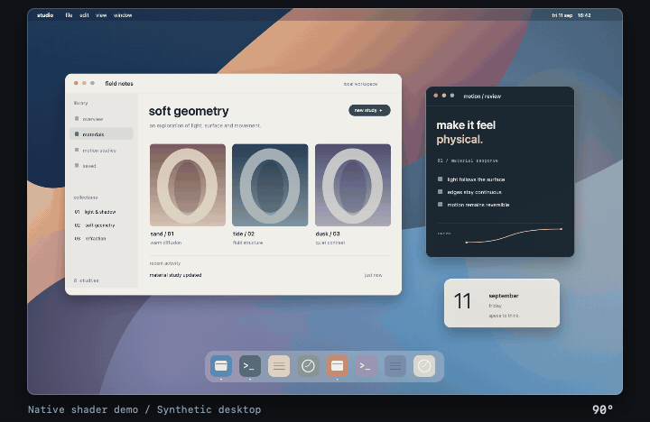

<p align="center"></p>

<p align="center">
  <a href="https://github.com/aldikosh23/Foldglass/releases/tag/v1.4.0"></a>
  
  
  <a href="../LICENSE"></a>
</p>

<p align="center">
  <a href="../README.md">English</a> · <b>Русский</b> · <a href="#установка">Установка</a> · <a href="#настройки">Настройки</a> · <a href="https://github.com/aldikosh23/Foldglass/issues">Сообщить о проблеме</a>
</p>

**Экран следует за крышкой.** При закрывании MacBook изображение растягивается от шарнира. Размытие и затемнение постепенно усиливаются от свободного края; нижняя часть дольше остаётся чёткой и светлой. Экран полностью гаснет ближе к концу закрывания. При открытии движение идёт обратно, в том числе на экране блокировки после сна. В конце эффект плавно растворяется, возвращая живое изображение.

Частота анимации подстраивается под дисплей: **60 FPS на экране 60 Гц** и **до 120 FPS с ProMotion**. Когда крышка останавливается, цикл анимации приостанавливается и возобновляется при движении. Размытие подготавливается один раз для каждого снимка. Режим 60 Гц измерен на MacBook Air; физическая проверка на дисплее 120 Гц пока не проводилась.



*Демонстрация на синтетическом рабочем столе, отрисованная шейдером приложения. Это не запись движения физической крышки.*

- Реакция на настоящий угол крышки, включая остановку и движение обратно.
- Настройка угла начала, размытия, затемнения и растяжения.
- Открытие после сна ещё до Touch ID или ввода пароля.
- Работа в строке меню и необязательный автозапуск в фоне.
- Полный русский и английский интерфейс. По умолчанию выбран английский.

## Установка

1. Скачайте [Foldglass-v1.4.0-macos-arm64.zip](https://github.com/aldikosh23/Foldglass/releases/download/v1.4.0/Foldglass-v1.4.0-macos-arm64.zip), распакуйте архив и перенесите `Foldglass.app` в папку **«Программы»** до первого запуска.
2. Откройте приложение. Сборка подписана локальной подписью **ad hoc и не прошла нотариализацию Apple**. Если macOS блокирует запуск и вы доверяете этому файлу, откройте **«Системные настройки > Конфиденциальность и безопасность > Всё равно открыть»** и подтвердите запуск. [Инструкция Apple](https://support.apple.com/ru-ru/102445).
3. Нажмите **Grant screen access** и разрешите Foldglass запись экрана в системных настройках. Если macOS предлагает завершить и снова открыть приложение, согласитесь. Раздел может упоминать системное аудио, но Foldglass его не захватывает.
4. В настройках приложения выберите **Language > Русский**. Выбор сохраняется и не зависит от языка macOS.
5. Поднимите крышку выше **92°**, затем медленно опустите ниже **90°**. Эффект должен следовать за движением и исчезнуть при открывании.

<details>
<summary>Проверить целостность скачанного архива</summary>

Скачайте `SHA256SUMS.txt` из того же релиза и положите рядом с архивом. Откройте Терминал в этой папке и выполните:

```sh
shasum -a 256 -c SHA256SUMS.txt
```

</details>

## Требования

| Компонент | Требование |
| --- | --- |
| Mac | MacBook на Apple Silicon с доступным HID-датчиком угла крышки |
| Система | macOS 14 или новее, поддержка Metal |
| Разрешение | Запись экрана для эффекта на встроенном дисплее |
| Проверено физически | **MacBook Air M5, macOS 27**, включая открытие из сна на экране блокировки |

macOS 14 является минимальной версией сборки, а не обещанием совместимости со всеми моделями и версиями системы. Другие конфигурации пока не проверены. Если датчик недоступен, приложение покажет ошибку. Встроенный предпросмотр работает без датчика и разрешения на запись экрана, если доступен Metal.

## Настройки

Нажмите значок ноутбука в строке меню, чтобы открыть настройки, приостановить эффект, запустить демонстрацию или выйти. Закрытие окна оставляет приложение работающим в фоне без значка в Dock.

| Настройка | По умолчанию | Действие |
| --- | --- | --- |
| **Начало** | 90° | Угол включения эффекта, доступен диапазон **30-115°** |
| **Матовое стекло** | 72 | Сила размытия от верхнего края |
| **Затемнение** | 1,05× | Скорость угасания; уменьшите, если экран темнеет слишком рано |
| **Растяжение** | 100% | Компенсация перспективы; 0% отключает растяжение |
| **Язык** | English | Мгновенное переключение между English и Русский |

Параметры сохраняются между запусками. **«Вернуть исходный эффект»** восстанавливает настройки анимации, включая начало с 90°.

**Удобный угол на коленях.** Установите крышку в удобное положение и нажмите **«Подстроить под текущую крышку»**. Начало станет на 10° ниже текущего угла, в пределах 30-115°. Например, при 80° эффект начнётся ниже 70°, а для повторного включения нужно поднять крышку до 72°. Небольшие наклоны при работе останутся выше порога.

**Повторное включение.** После отмены, паузы или изменения угла начала поднимите крышку минимум на 2° выше установленного порога. При исходных настройках это **92°**. Изменение порога снимает текущий эффект.

| Управление | Действие |
| --- | --- |
| **Проиграть** | Шестисекундная анимация внутри окна, без доступа к экрану |
| **Предпросмотр угла** | Просмотр эффекта в выбранном положении крышки |
| **Обновить снимок** | Свежий снимок рабочего стола для предпросмотра |
| **Демо на экране** | Шестисекундная анимация на встроенном дисплее |
| **Приостановить эффект** | Пауза до повторного включения или следующего запуска |

На рабочем столе **клик мышью или трекпадом отменяет эффект**. Esc тоже работает, если macOS передаёт приложению это событие. На экране блокировки слой пропускает клики и не забирает фокус клавиатуры; он исчезает при разблокировке или открытии крышки до угла начала.

## Фоновый запуск

Включите **«Запускать при входе в macOS»**. При следующем входе Foldglass запустится в фоне со значком в строке меню, без окна настроек. Для новой установки автозапуск выключен. Обычный ручной запуск открывает настройки.

Если macOS ожидает подтверждение, нажмите **«Разрешить в настройках»** и разрешите Foldglass в системных объектах входа. Автозапуск использует `SMAppService`; отключить его можно тем же переключателем или через **«Системные настройки > Основные > Объекты входа и расширения»**.

Оставляйте приложение в папке «Программы». Перед переносом отключите автозапуск, а после запуска из нового места включите его снова. Команда **«Завершить Foldglass»** закрывает приложение, но не отключает автозапуск.

## Открытие после сна

Поднимите крышку выше порога готовности, закройте полностью, дождитесь сна и медленно откройте. После пробуждения дисплея анимация следует за настоящим углом крышки **на экране блокировки, ещё до Touch ID или ввода пароля**.

Foldglass делает свежий снимок блокировки с часами. Пустые кадры при пробуждении отбрасываются: если готовое изображение не появилось вовремя, эффект пропускается. При разблокировке или достижении угла начала слой исчезает. Если крышка уже открыта, запоздалый повтор анимации не запускается.

> **Экспериментальная поддержка блокировки.** Отображение слоя использует приватные API SkyLight, работа которых может измениться после обновления macOS. Проверена блокировка уже запущенного пользовательского сеанса на MacBook Air M5 с macOS 27. Экран FileVault при включении компьютера и вход до запуска приложения не поддерживаются.

## Конфиденциальность

Приложение захватывает встроенный дисплей через **ScreenCaptureKit** и анимирует один готовый снимок. Изображение и текстуры остаются в оперативной памяти и **не записываются на диск**. Снимок предпросмотра хранится в памяти до замены или закрытия приложения.

- На блокировке используется свежий снимок самого экрана блокировки. Снимок рабочего стола до блокировки для этого не используется.
- Слой блокировки пропускает нажатия мыши, не забирает фокус клавиатуры и исчезает при разблокировке.
- Нет аккаунтов, аналитики, телеметрии, автоматических обновлений и сетевых запросов. Кнопка «Референс» открывает сайт в браузере.
- Аудио не захватывается. Разрешения на микрофон и универсальный доступ не нужны.
- Эффект работает только на встроенном дисплее. Внешние мониторы не меняются, системный сон не блокируется.

Изображение внутри эффекта заморожено: видео, часы и содержимое окон не обновляются до исчезновения слоя. Датчик опрашивается 30 раз в секунду, движение сглаживается при отрисовке. Восприятие перспективы зависит от положения головы; настройте «Растяжение» под свой угол обзора.

## Устранение проблем

<details>
<summary>Разрешения, датчик, автозапуск и отсутствие эффекта</summary>

| Ситуация | Что проверить |
| --- | --- |
| Нужен доступ к записи экрана | Разрешите Foldglass запись экрана и перезапустите приложение, если macOS этого требует |
| «Подними крышку выше …°» | Поднимите крышку до указанного угла для повторного включения |
| Датчик угла крышки не найден | На этой модели или версии macOS нужный HID-датчик может быть недоступен |
| Ошибка чтения HID | Сохраните точный текст ошибки, перезапустите приложение и приложите результат к отчёту |
| Предпросмотр работает, эффекта на экране нет | Проверьте разрешение, паузу, порог готовности и наличие встроенного дисплея |
| Нет эффекта после пробуждения | Открывайте крышку медленно. Если изображение ещё не готово или угол уже выше порога, эффект пропускается |
| Блокировка перестала анимироваться после обновления macOS | Приватные API SkyLight могли измениться. Укажите версию системы в отчёте |
| Приложение не запустилось при входе | Проверьте его расположение в «Программах» и разрешение в объектах входа |
| На внешнем мониторе нет эффекта | Поддерживается только встроенный дисплей MacBook |

[Сообщить о проблеме](https://github.com/aldikosh23/Foldglass/issues). Укажите модель MacBook, версию macOS, точный текст ошибки, меняется ли показание угла, и шаги воспроизведения. Для визуальной проблемы добавьте значения настроек эффекта.

</details>

<details>
<summary>Удалить приложение</summary>

Отключите автозапуск, выберите **«Завершить Foldglass»** в строке меню и удалите приложение из папки «Программы». При желании уберите разрешение на запись экрана в системных настройках.

</details>

## Сборка из исходников

<details>
<summary>Сборка, проверки и подготовка релиза</summary>

Нужен Mac на Apple Silicon с macOS 14 или новее и Apple Command Line Tools. Если инструменты ещё не установлены:

```sh
xcode-select --install
```

Клонируйте репозиторий и соберите приложение:

```sh
git clone https://github.com/aldikosh23/Foldglass.git
cd Foldglass
./build.sh
open build/Foldglass.app
```

Используются `swiftc`, системные фреймворки и Metal. Пакетный менеджер и скачивание зависимостей не нужны. Код интеграции SkyLight включён в репозиторий; лицензия указана в [THIRD_PARTY_NOTICES.md](../THIRD_PARTY_NOTICES.md).

Скрипт создаёт arm64-приложение в `build/Foldglass.app`, копирует ресурсы, ставит подпись ad hoc и проверяет структуру сборки. Для постоянного использования завершите приложение и перенесите его в «Программы», затем включите автозапуск. Подпись ad hoc не заменяет нотариализацию Apple.

```sh
# Автоматические проверки
./scripts/test.sh

# Дополнительно проверить настоящую отрисовку Metal
RUN_METAL_TESTS=1 ./scripts/test.sh

# Собрать архив релиза и контрольные суммы
./scripts/release.sh
```

Автоматические проверки не заменяют проверку разрешений, физического датчика, входа в систему, сна и пробуждения на реальном MacBook.

Для обновления изображений README из настоящего Metal-рендера установите FFmpeg и запустите `./scripts/media.sh`. Самому приложению FFmpeg не нужен.

</details>

## Лицензия и референсы

Код открыт по [лицензии MIT](../LICENSE).

- [iPhone Duo](https://www.apple.com/iphone-duo/) и [оригинальная анимация Apple](https://www.apple.com/105/media/us/iphone-duo/2026/9305e4b9-72d9-4c05-9381-b572adadd5e5/anim/hero/large_2x.mp4): визуальные референсы.
- [LidAngleSensor от Sam Gold](https://github.com/samhenrigold/LidAngleSensor): исследование HID-протокола датчика. Реализация Foldglass написана отдельно, исходный код этого проекта не копировался.
- [SkyLightWindow от Lakr233](https://github.com/Lakr233/SkyLightWindow): основа интеграции экрана блокировки под лицензией MIT. Атрибуция и лицензия находятся в [THIRD_PARTY_NOTICES.md](../THIRD_PARTY_NOTICES.md).

Foldglass является независимой визуальной реконструкцией. Проект не связан с Apple и не одобрен компанией. Apple, iPhone, MacBook и macOS являются товарными знаками Apple Inc.
